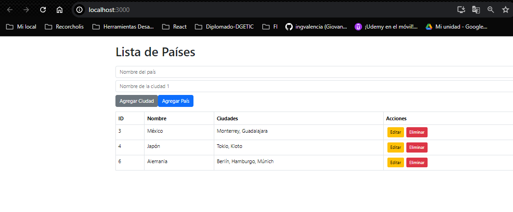
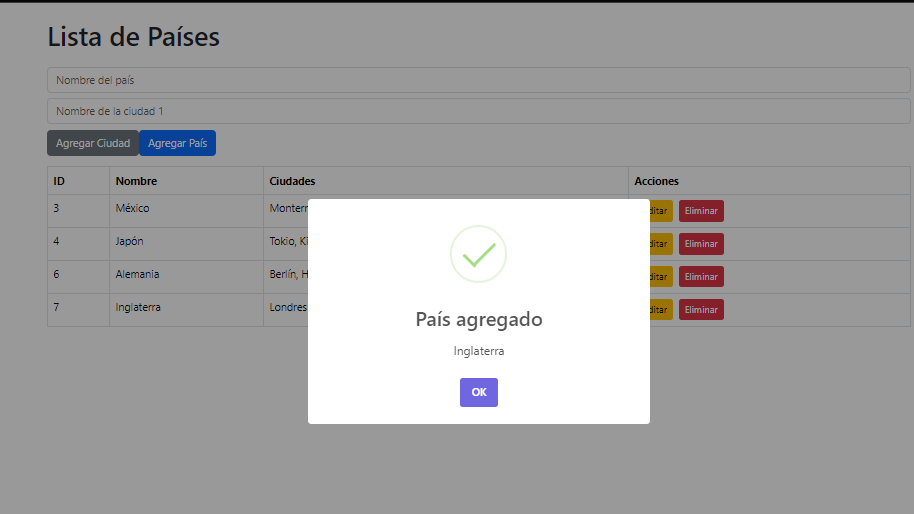

# Sistema CRUD de Países y Ciudades

## Descripción
Este proyecto es un sistema CRUD de países y ciudades desarrollado con Laravel 9 para el backend y React para el frontend.

## Capturas de Pantalla

### Vista de Lista de Países


### Formulario para Agregar País


### Vista de Edición de País


## Instalación

### La Base de datos importarla dentro de la carpeta BD.

### Backend (Laravel)
1. Clona el repositorio:
    ```bash
    git clone https://github.com/tu_usuario/nombre_del_repositorio.git
    ```
2. Navega al directorio del proyecto:
    ```bash
    cd nombre_del_repositorio
    ```
3. Instala las dependencias de Composer:
    ```bash
    composer install
    ```
4. Configura el archivo `.env` con tus credenciales de base de datos.
5. Ejecuta las migraciones:
    ```bash
    php artisan migrate
    ```
6. Ejecuta el servidor de desarrollo:
    ```bash
    php artisan serve
    ```

### Frontend (React)
1. Navega al directorio del frontend:
    ```bash
    cd frond_pais_ciudad
    ```
2. Instala las dependencias de npm:
    ```bash
    npm install
    ```
3. Construye la aplicación para producción:
    ```bash
    npm run build
    ```
4. Copia los archivos construidos a la carpeta `public` de Laravel:
    ```bash
    cp -r build/* ../public/
    ```

## Uso
1. Accede a la aplicación en `http://localhost:8000`.
2. Utiliza la interfaz para gestionar países y ciudades.

## Endpoints
### Listado de Países con Ciudades
- Método: GET
- URL: `/api/paises`

### Crear un País
- Método: POST
- URL: `/api/paises`
- Body:
  ```json
  {
      "nombre": "Argentina",
      "ciudades": [
          { "nombre": "Buenos Aires" },
          { "nombre": "Córdoba" },
          { "nombre": "Rosario" }
      ]
  }
